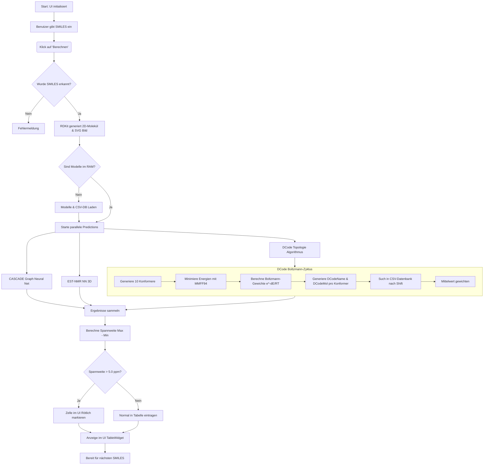

# Dokumentation der NMR 13C Prediction App

Diese Applikation bietet eine grafische Oberfläche zur Vorhersage von 13C-NMR-Verschiebungen (Nuclear Magnetic Resonance) anhand von SMILES-Codes. Sie vereint drei unabhängige Vorhersagemethoden und aggregiert diese, um eine robuste Konsens-Schätzung und eine Fehlereinschätzung über die Spannweite bereitzustellen. 

## 1. Programmablaufplan (Flowchart)

## 2. Implementierte Methoden

### 2.1 CASCADE (Graph Neural Network)
Die `predict_cascade`-Funktion basiert auf einem Graph Neural Network Modell (`GraphModel` via `tf_keras`/`nfp` Layer). 
* **Funktionsweise**: Es formt das RDKit-Molekül über einen Preprocessor in ein Graph-Format um (Knoten = Atome, Kanten = Bindungen). Das Modell erzeugt konformerspezifische Graph-Embeddings.
* **Besonderheit**: CASCADE generiert intern eigene Konformere und wichtet die chemische Vorhersage per Boltzmann-Ansatz (durch MMFF generierte relative Energien).
* **Quelle**: G.N.N Entwicklungen im Rahmen des CASCADE 13C-C-NMR Prediction Projekts.

### 2.2 EST-NMR (DLNMR1.pt PyTorch Modell)
Die `predict_est_nmr`-Funktion lädt ein pre-trained PyTorch Modell. Dieses Neural Network operiert direkt auf den dreidimensionalen Koordinaten der Atomarten.
* **Funktionsweise**: Das 1D RDKit-Molekül wird (sofern nicht anders vorhanden) gebettet und via MMFF94 optimiert. Koordinatenvektor und Atomtypenvektor werden als Tensoren an das PyTorch-Modell übergeben, welches die Shift-Werte pro Atom index-genau schätzt.
* **Quelle**: Neuronales Netzwerk. Zitat: Thomas Hehre, Philip E. Klunzinger, Bernard J. Deppmeier, William Sean Ohlinger, Warren J Hehre, doi:10.1021/acs.joc.5c00927.

### 2.3 DCode (Distance & Topology Code)
Die `predict_dcode_boltzmann`-Funktion verwendet einen proprietären, neu integrierten Topologie-Code-Algorithmus aus dem bereitgestellten Github (`steto123/dcode`).
* **Funktionsweise**: Für jedes 3D-Konformer (10 Stück) wird für jedes Kohlenstoffatom ermittelt, welche Nachbarn (und Atom-Art) in einem Radius von 6 Ångström liegen. Diese topologische Information führt zu einem String-Code (z.B. "C4rn@..."). Danach wird in einer >47 MB großen CSV-Datenbank nach genau diesem Topologie-Code gesucht und der Durchschnitt als Shift angenommen.
* **Boltzmann-Wichtung**: Die Verschiebungen aus den 10 Konformeren werden anhand ihrer MMFF-Energien nach $\exp(-\Delta E/RT)$ gewichtet. Weicht eine Geometrie stark vom Energieminimum ab, fließt ihr prognostizierter Shift kaum in den finalen Wert mit ein.

### 2.4 Spannweite als Qualitätssiegel
Für jedes C-Atom vergleicht das Skript die berechneten Werte aller 3 Modelle. Die `"Spannweite"` wird als `Maximum(Shifts) - Minimum(Shifts)` berechnet. Liegt sie höher als 5 ppm, wird die Tabelle rot markiert. Dies weist den Experten auf herausfordernde stereochemische Bereiche, anormale Elektronegativitäten oder RDKit-Geometriefehler hin.
