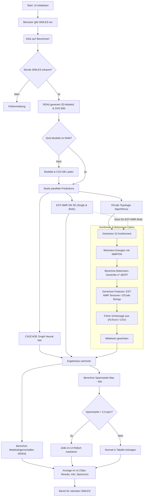
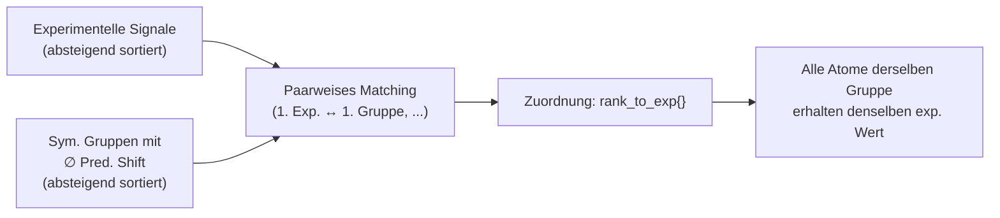
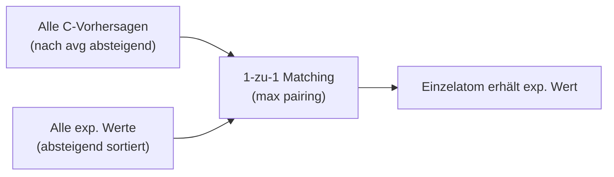
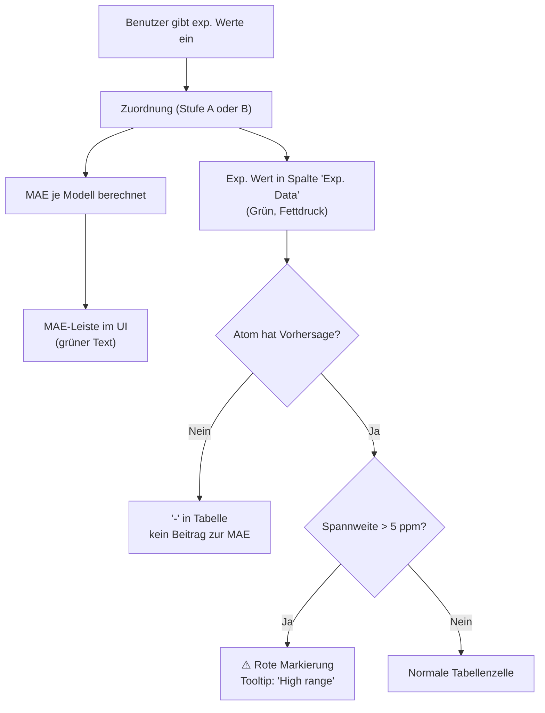
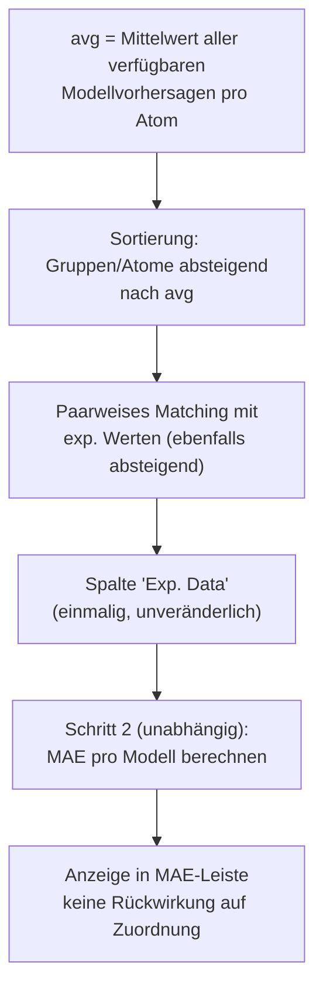

# Dokumentation der NMR 13C Prediction App

Diese Applikation bietet eine grafische Oberfläche zur Vorhersage von 13C-NMR-Verschiebungen (Nuclear Magnetic Resonance) anhand von SMILES-Codes. Sie vereint drei unabhängige Vorhersagemethoden und aggregiert diese, um eine robuste Konsens-Schätzung und eine Fehlereinschätzung über die Spannweite bereitzustellen. 

## 1. Programmablaufplan (Flowchart)


```mermaid
graph TD
    A["Start: UI initialisiert"] --> B["Benutzer gibt SMILES ein"]
    B --> C("Klick auf 'Berechnen'")
    
    C --> D{"Wurde SMILES erkannt?"}
    D -- Nein --> E["Fehlermeldung"]
    D -- Ja --> F["RDKit generiert 2D-Molekül & SVG Bild"]
    
    F --> G{"Sind Modelle im RAM?"}
    G -- Nein --> H["Modelle & CSV-DB Laden"]
    H --> I
    G -- Ja --> I["Starte parallele Predictions"]
    
    I --> J["CASCADE Graph Neural Net"]
    I --> K["EST-NMR NN 3D (Single & Boltz)"]
    I --> L["DCode Topologie Algorithmus"]
    
    subgraph Konformere ["Konformer & Boltzmann Zyklus"]
        L1["Generiere 10 Konformere"] --> L2["Minimiere Energien mit MMFF94"]
        L2 --> L3["Berechne Boltzmann-Gewichte e^-dE/RT"]
        L3 --> L4["Generiere Features: EST-NMR Tensoren / DCode Strings"]
        L4 --> L5["Führe Vorhersage aus (PyTorch / CSV)"]
        L5 --> L6["Mittelwert gewichten"]
    end
    
    L --> L1
    K -.->|Nutzt für EST-NMR Boltz| L1
    
    J --> M["Ergebnisse sammeln"]
    K --> M
    L6 --> M
    
    M --> N["Berechne Spannweite Max - Min"]
    M --> N2["Berechne Moleküleigenschaften (RDKit)"]
    N --> O{Spannweite > 5.0 ppm?}
    N2 --> R
    O -- Ja --> P["Zelle im UI Rötlich markieren"]
    O -- Nein --> Q["Normal in Tabelle eintragen"]
    
    P --> R["Anzeige im UI (Tabs: Results, Info, Spectrum)"]
    Q --> R
    R --> S["Bereit für nächsten SMILES"]
```

## 2. Implementierte Methoden

### 2.1 CASCADE (Graph Neural Network)
Die `predict_cascade`-Funktion basiert auf einem Graph Neural Network Modell (`GraphModel` via `tf_keras`/`nfp` Layer). 
* **Funktionsweise**: Es formt das RDKit-Molekül über einen Preprocessor in ein Graph-Format um (Knoten = Atome, Kanten = Bindungen). Das Modell erzeugt konformerspezifische Graph-Embeddings.
* **Besonderheit**: CASCADE generiert intern eigene Konformere und wichtet die chemische Vorhersage per Boltzmann-Ansatz (durch MMFF generierte relative Energien).
* **Quelle**: G.N.N Entwicklungen im Rahmen des CASCADE 13C-C-NMR Prediction Projekts.

### 2.2 EST-NMR (DLNMR1.pt PyTorch Modell)
Die Funktionen `predict_est_nmr` und `predict_est_nmr_boltzmann` laden ein pre-trained PyTorch Modell. Dieses Neural Network operiert direkt auf den dreidimensionalen Koordinaten der Atomarten.
* **Funktionsweise (Single)**: Das 1D RDKit-Molekül wird (sofern nicht anders vorhanden) gebettet und via MMFF94 optimiert. Koordinatenvektor und Atomtypenvektor werden als Tensoren an das PyTorch-Modell übergeben, welches die Shift-Werte pro Atom index-genau schätzt.
* **Funktionsweise (Boltzmann)**: Analog zur DCode Methode werden 10 verschiedene Konformere generiert und im Kraftfeld minimiert. Das NN schätzt die chemischen Verschiebungen für jedes Konformer separat. Das Endergebnis ist der gemäß der relativen Energien Boltzmann-gewichtete Mittelwert ($\exp(-\Delta E/RT)$). In der Ergebnistabelle werden beide Varianten (`EST-NMR` und `EST-NMR (Boltz)`) für einen direkten Vergleich dargestellt.
* **Quelle**: Neuronales Netzwerk. Zitat: Thomas Hehre, Philip E. Klunzinger, Bernard J. Deppmeier, William Sean Ohlinger, Warren J Hehre, doi:10.1021/acs.joc.5c00927.

### 2.3 DCode (Distance & Topology Code)
Die `predict_dcode_boltzmann`-Funktion verwendet einen proprietären, neu integrierten Topologie-Code-Algorithmus aus dem bereitgestellten Github (`steto123/dcode`).
* **Funktionsweise**: Für jedes 3D-Konformer (10 Stück) wird für jedes Kohlenstoffatom ermittelt, welche Nachbarn (und Atom-Art) in einem Radius von 6 Ångström liegen. Diese topologische Information führt zu einem String-Code (z.B. "C4rn@..."). Danach wird in einer >47 MB großen CSV-Datenbank nach genau diesem Topologie-Code gesucht und der Durchschnitt als Shift angenommen.
* **Boltzmann-Wichtung**: Die Verschiebungen aus den 10 Konformeren werden anhand ihrer MMFF-Energien nach $\exp(-\Delta E/RT)$ gewichtet. Weicht eine Geometrie stark vom Energieminimum ab, fließt ihr prognostizierter Shift kaum in den finalen Wert mit ein.

### 2.4 Spannweite als Qualitätssiegel
Für jedes C-Atom vergleicht das Skript die berechneten Werte aller 3 Modelle. Die `"Spannweite"` wird als `Maximum(Shifts) - Minimum(Shifts)` berechnet. Liegt sie höher als 5 ppm, wird die Tabelle rot markiert. Dies weist den Experten auf herausfordernde stereochemische Bereiche, anormale Elektronegativitäten oder RDKit-Geometriefehler hin.

## 2.5 Symmetrie-Mittelung (Experimentelles Feature)
Die Applikation nutzt ein hybrides Verfahren zur Identifizierung chemisch äquivalenter Atome, um die Vorhersagequalität zu steigern.

*   **Hybrid-Ansatz**:
    1.  **Topologisches Ranking**: Zuerst wird via `RDKit.Chem.CanonicalRankAtoms` ein Basis-Ranking erstellt, das Chiralität und stereochemische Zentren berücksichtigt.
    2.  **Räumliche Verfeinerung (3D)**: Da rein topologische Verfahren oft Probleme haben, räumliche Unterschiede wie Cis/Trans-Positionen oder Axial/Äquatorial-Stellungen in Ringen zu unterscheiden (wenn diese topologisch identisch erscheinen), wird eine zusätzliche geometrische Analyse durchgeführt.
*   **Funktionsweise der 3D-Verfeinerung**:
    *   Für jedes Atom wird ein "geometrischer Fingerabdruck" basierend auf den Distanzen zu allen anderen Atomen in der stabilsten 3D-Konformation berechnet.
    *   Atome werden nur dann als symmetrisch äquivalent gruppiert, wenn sie sowohl topologisch gleich sind als auch räumlich innerhalb einer **Toleranz von 0,4 Å** liegen.
    *   **Nutzen**: Dies ermöglicht es, rotierende Gruppen (wie Phenylringe) trotz minimaler 3D-Verzerrungen zusammenzufassen, während starre geometrische Isomere (Cis/Trans) zuverlässig unterschieden werden.
*   **Symmetry Average Option**: Über die Checkbox `"Symmetry Average"` im UI kann gesteuert werden, ob die Vorhersagewerte für äquivalente Atome gemittelt werden sollen. 
    *   *Aktiviert*: Alle Atome desselben Rangs erhalten denselben gemittelten Shift-Wert. Dies entspricht der chemischen Erwartung für frei rotierende oder symmetrische Moleküle in Lösung.
    *   *Deaktiviert*: Jedes Atom behält seinen individuellen Vorhersagewert (nützlich zur Analyse von Geometrie-Effekten oder Instabilitäten der Modelle).
*   **Hinweis (Experimentell)**: Da die Symmetrie-Erkennung von der Qualität der initialen 3D-Einbettung (MMFF94) abhängt, kann es in seltenen Fällen bei sehr flexiblen Molekülen zu einer Über- oder Untersegmentierung kommen. Die Ergebnisse sollten daher im Einzelfall kritisch geprüft werden. Der Rang wird zur Kontrolle in der Spalte `"Sym. Rank"` angezeigt.

## 3. Zuordnung experimenteller Verschiebungen (Auto-MAE)

### 3.1 Überblick und Motivation

Die App ermöglicht es, optionale experimentelle ¹³C-Verschiebungen in das Feld **„Exp. Data"** einzugeben. Das Programm ordnet diese Werte dann automatisch den berechneten Atom-Vorhersagen zu und berechnet für jedes der drei Modelle den **Mean Absolute Error (MAE)**:

$$\text{MAE} = \frac{1}{n} \sum_{i=1}^{n} |\delta_{\text{exp},i} - \delta_{\text{pred},i}|$$

Da im NMR-Experiment keine Aussage darüber existiert, welche gemessene Verschiebung zu welchem Atom gehört, muss das Programm diese Zuordnung **algorithmisch** lösen. Das Verfahren ist bewusst **symmetriebewusst** und nutzt die zuvor berechneten Symmetriegruppen (Sym. Rank), um die Anzahl der unabhängigen Signale korrekt zu bestimmen.

---

### 3.2 Eingabe und Vorverarbeitung

Der Nutzer gibt eine kommagetrennte Liste von Verschiebungswerten ein, z.B.:

```
128.4, 127.1, 115.0, 55.3, 21.8
```

Intern werden die Werte wie folgt verarbeitet (`nmr_app.py`, Zeile ~1219):

```python
exp_shifts = [float(x.strip()) for x in exp_text.replace(';', ',').split(',') if x.strip()]
exp_shifts.sort(reverse=True)   # Absteigend sortieren: 128.4 > 127.1 > 115.0 > ...
```

> **Wichtig:** Sowohl die experimentellen Werte als auch die berechneten Durchschnittsprognosen werden **immer absteigend sortiert** und dann paarweise verglichen. Dieses Verfahren – bekannt als *ordnungsbasiertes Matching* – ist die effizienteste und robusteste Methode für NMR-Spektren ohne vorherige Zuordnung (Referenzierung: Bally & Rablen, *J. Org. Chem.* 2011).

---

### 3.3 Das zweistufige Zuordnungsverfahren

#### Stufe A: Symmetriegruppenbasierte Zuordnung (bevorzugter Pfad)

Wenn die Anzahl der eingegebenen experimentellen Signale **kleiner oder gleich** der Anzahl symmetrisch einzigartiger Kohlenstoffatome (Unique Sym. Ranks) ist, verwendet das Programm die **gruppenbasierte Methode**:


```mermaid
flowchart LR
    A["Experimentelle Signale\n(absteigend sortiert)"] --> C
    B["Sym. Gruppen mit\n∅ Pred. Shift\n(absteigend sortiert)"] --> C
    C["Paarweises Matching\n(1. Exp. ↔ 1. Gruppe, ...)"] --> D["Zuordnung: rank_to_exp{}"]
    D --> E["Alle Atome derselben Gruppe\nerhalten denselben exp. Wert"]
```

**Schritt für Schritt:**

1. Alle Kohlenstoffatome werden nach ihrem `sym_rank` gruppiert.
2. Pro Gruppe wird der **Durchschnitts-Shift** aller Modelle (`avg`) berechnet.
3. Die Gruppen werden **absteigend** nach diesem Durchschnitt sortiert.
4. Die experimentellen Werte (ebenfalls absteigend) werden **paarweise** den Gruppen zugeordnet.
5. Alle Atome einer Gruppe teilen dann denselben experimentellen Wert.

**Beispiel:** Benzol (C₆H₅-OH, Phenol)
- Symmetriegruppen: C1 (ipso, Rang 0), C2+C6 (ortho, Rang 1), C3+C5 (meta, Rang 2), C4 (para, Rang 3)
- 4 einzigartige Signale im NMR: 155.1, 130.2, 115.6, 121.0 ppm
- Das Programm ordnet die 4 experimentellen Werte den 4 Gruppen zu.

#### Stufe B: 1-zu-1 Fallback (bei zu vielen Signalen)

Wenn die Anzahl der experimentellen Werte **größer** als die Anzahl der Symmetriegruppen ist (z.B. kein Symmetriemodus aktiv oder sehr flexibles Molekül), wechselt das Programm in den **1-zu-1 Modus**:


```mermaid
flowchart LR
    A["Alle C-Vorhersagen\n(nach avg absteigend)"] --> C
    B["Alle exp. Werte\n(absteigend sortiert)"] --> C
    C["1-zu-1 Matching\n(max pairing)"] --> D["Einzelatom erhält exp. Wert"]
```

Auch hier gilt: Es werden maximal so viele Paare gebildet, wie Werte auf der kürzeren Seite vorhanden sind.

---

### 3.4 MAE-Berechnung und Fehlerumgang

Die MAE-Berechnung für jedes Modell (CASCADE, EST-NMR, etc.) läuft **unabhängig** vom Tabellenanzeigeschritt ab. Sie verwendet dieselbe Zuordnungslogik, aber bezogen auf die Vorhersagen des jeweiligen Modells, nicht auf einen gemittelten Wert:

```python
# Symmetriegruppenbasiert (Stufe A):
group_avg_preds = sorted([mean(vals) for vals in rank_groups.values()], reverse=True)
errors = [abs(exp[i] - group_avg_preds[i]) for i in range(n_pairs)]
mae = mean(errors)

# 1-zu-1 (Stufe B):
p_vals = sorted([p['val'] for p in atom_preds], reverse=True)
errors = [abs(exp[i] - p_vals[i]) for i in range(n_pairs)]
mae = mean(errors)
```

Das Ergebnis wird im UI als Statusleiste angezeigt, z.B.:

```
Exp. MAE: CASCADE: 3.21 ppm | EST-NMR: 5.14 ppm | EST-NMR (Boltz): 4.87 ppm | DCode: 6.02 ppm
```

---

### 3.5 Umgang mit großen Fehlern (Robustheit)

Das Verfahren ist so konzipiert, dass größere Fehler – auch solche, die durch fehlerhafte Berechnungen in CASCADE oder DCode entstehen – **abgefangen und nicht propagiert werden**. Die folgende Tabelle zeigt, welche Szenarien auftreten können und wie die App damit umgeht:

| Fehlertyp | Ursache | Verhalten der App |
|:---|:---|:---|
| **Kein DCode-Treffer** (`-999`) | Der Topologie-String ist in der CSV-DB unbekannt | Das Atom bekommt `NaN`; wird bei Spannweite und MAE ignoriert |
| **Modell gibt `NaN` zurück** | EST-NMR schlägt für ein Atom fehl (z.B. exotische Geometrie) | `NaN` wird in allen Berechnungen übersprungen |
| **Hohe Spannweite (> 5 ppm)** | Modelle sind sich stark uneinig | Zelle wird rot/orange markiert mit ⚠️-Symbol; kein Programmabbruch |
| **Zu wenige exp. Werte** | Nutzer gibt weniger Werte an als Atome vorhanden | Nur so viele Paare werden gebildet wie Werte vorhanden; Rest bleibt leer (`-`) |
| **Zu viele exp. Werte** | Nutzer gibt mehr Werte an als C-Atome | Überschüssige exp. Werte werden ignoriert |
| **Ungültige exp. Eingabe** | Text enthält Buchstaben, Leerzeichen etc. | Fehlermeldung im Label: `"Invalid format in Exp. Data!"` |
| **CASCADE-Fehler (unbekannte Elemente)** | Halogene, Metalle etc. nicht im Trainingsset | Warnung im UI (`"Warning: CASCADE only for C, H, N, O, S, P, F, Cl"`); Berechnung läuft dennoch weiter |
| **DCode DB fehlt** | `v3_update_23_10_2025.csv` nicht gefunden | DCode-Spalte bleibt komplett leer; die anderen 3 Modelle bleiben unberührt |
| **Konformergenerierung schlägt fehl** | RDKit-Embedding unmöglich (z.B. sehr gespannte Strukturen) | Fallback auf 2D-Struktur; ein einzelnes Konformer mit Gewicht 1.0 |

> **Kernprinzip:** Die Fehlerbehandlung ist **defensiv** – jeder Fehler in einem Teilsystem wird isoliert. Die App zeigt stets Ergebnisse für alle verfügbaren Methoden an, ohne durch einen Fehler in einem Modell zum Absturz gebracht zu werden.

---

### 3.6 Visuelle Rückmeldung im UI


```mermaid
flowchart TD
    A["Benutzer gibt exp. Werte ein"] --> B["Zuordnung (Stufe A oder B)"]
    B --> C["Exp. Wert in Spalte 'Exp. Data'\n(Grün, Fettdruck)"]
    B --> D["MAE je Modell berechnet"]
    D --> E["MAE-Leiste im UI\n(grüner Text)"]
    C --> F{"Atom hat Vorhersage?"}
    F -- Nein --> G["'-' in Tabelle\nkein Beitrag zur MAE"]
    F -- Ja --> H{"Spannweite > 5 ppm?"}
    H -- Ja --> I["⚠️ Rote Markierung\nTooltip: 'High range'"]
    H -- Nein --> J["Normale Tabellenzelle"]
```

---

### 3.7 Grundlage der Zuordnung: Modellmittelwert, nicht MAE-Optimierung

#### Wie die finale Zuordnung in der Spalte „Exp. Data" entsteht

Die Zuordnung in der Tabellenspalte **„Exp. Data"** beruht ausschließlich auf dem **modellübergreifenden Durchschnitt** (`avg`) der Vorhersagen – sie ist damit **weder modellspezifisch noch MAE-optimiert**.

Konkret wird beim Aufbau der Ergebnisliste für jedes C-Atom berechnet:

```python
# nmr_app.py, Zeile ~1214
valid_shifts = [x for x in [pc, pe, peb, pd_val] if not np.isnan(x)]
'avg': sum(valid_shifts) / len(valid_shifts)   # globaler Mittelwert über alle Modelle
```

Dieser `avg`-Wert wird für die Sortierung der Gruppen bzw. Atome vor dem paarweisen Matching herangezogen:

```python
# Stufe A (symmetriegruppenbasiert)
group_shifts.sort(key=lambda x: x['avg_pred'], reverse=True)  # avg aus avg der Atomavgs

# Stufe B (1-zu-1 Fallback)
results_list.sort(key=lambda x: x['avg'], reverse=True)
```

**Die Zuordnung wird einmalig festgelegt** – dann werden die experimentellen Werte dauerhaft in die Tabelle eingetragen. Es gibt keine Iteration, keine Optimierungsschleife und keine Auswahl der „besten" Zuordnung anhand der resultierenden MAE.

---

#### Ablauf der zwei Schritte im Überblick


```mermaid
flowchart TD
    A["avg = Mittelwert aller verfügbaren\nModellvorhersagen pro Atom"] --> B
    B["Sortierung: Gruppen/Atome absteigend\nnach avg"] --> C
    C["Paarweises Matching mit\nexp. Werten (ebenfalls absteigend)"] --> D["Spalte 'Exp. Data'\n(einmalig, unveränderlich)"]
    D --> E["Schritt 2 (unabhängig):\nMAE pro Modell berechnen"]
    E --> F["Anzeige in MAE-Leiste\nkeine Rückwirkung auf Zuordnung"]
```

> Die MAE-Werte, die in der Statusleiste angezeigt werden, **beeinflussen nicht** die in der Tabelle gezeigte Zuordnung. Sie sind eine reine Auswertung, keine Optimierungsrückkopplung.

---

#### Folge: Potenzielle Schwäche bei stark abweichenden Modellen

Das `avg`-basierte Verfahren ist solange robust, wie alle Modelle in einer ähnlichen Größenordnung liegen. Weicht jedoch ein Modell stark ab, **verschiebt es den globalen Mittelwert** und kann dadurch die Sortierreihenfolge der Atome/Gruppen verändern – mit der Konsequenz, dass die Zuordnung für **alle** Modelle suboptimal wird.

**Konkretes Beispiel:**

Angenommen, ein Molekül hat zwei C-Atome mit den folgenden Vorhersagen:

| Atom | CASCADE | EST-NMR | DCode | avg |
|:---:|:---:|:---:|:---:|:---:|
| C₁ | 130 ppm | 128 ppm | **40 ppm** (DCode-Fehler!) | **99 ppm** |
| C₂ | 50 ppm | 52 ppm | 51 ppm | 51 ppm |

Experimentell: `128.5 ppm, 51.0 ppm`

- **Korrekte Zuordnung** (nach Chemie): `C₁ → 128.5`, `C₂ → 51.0`
- **Zuordnung durch avg**: `avg(C₁) = 99 > avg(C₂) = 51` → C₁ bekommt `128.5` ✅

In diesem Fall klappt es noch, weil C₁ trotz DCode-Ausreißer den höheren Mittelwert behält. Aber:

| Atom | CASCADE | EST-NMR | DCode | avg |
|:---:|:---:|:---:|:---:|:---:|
| C₁ | 130 ppm | 128 ppm | **20 ppm** (extremer DCode-Fehler!) | **92 ppm** |
| C₂ | 110 ppm | 112 ppm | 111 ppm | **111 ppm** |

Jetzt: `avg(C₂) = 111 > avg(C₁) = 92` → C₂ bekommt fälschlicherweise den höheren exp. Wert zugewiesen ❌

Dies ist kein reales Berechnungsbeispiel, sondern illustriert das Prinzip. In der Praxis treten solche extremen DCode-Ausreißer in der Regel nur dann auf, wenn:
- Das Molekül hochgradig unüblich aufgebaut ist (kein Datenbanktreffer → `-999`)
- Die Konformergenerierung fehlschlägt (extreme Geometrie)
- Beide Fälle werden als `NaN` behandelt und **aus dem `avg` herausgenommen**, was das Risiko deutlich reduziert.

---

#### Wann ist das Verfahren zuverlässig?

| Situation | Zuverlässigkeit der Zuordnung |
|:---|:---|
| Alle Modelle einig (Spannweite < 5 ppm) | ✅ Sehr hoch – `avg`-Sortierung stimmt zuverlässig |
| Ein Modell leicht abweichend (5–15 ppm) | ✅ In der Regel noch korrekt |
| Ein Modell stark abweichend (> 15 ppm) | ⚠️ Zuordnung kann sich verschieben – Spannweite-Warnung beachten! |
| Modell gibt `NaN` zurück | ✅ `NaN` wird aus avg ausgeschlossen, Wirkung minimiert |
| DCode gibt `-999` zurück | ✅ Wie `NaN` behandelt, kein Einfluss auf avg |

> **Empfehlung:** Bei Atomen mit ⚠️-Markierung (hohe Spannweite) sollte die in „Exp. Data" angezeigte Zuordnung kritisch geprüft werden. In solchen Fällen kann es sinnvoll sein, das Experiment manuell mit den Einzelmodell-Vorhersagen in CASCADE, EST-NMR und DCode abzugleichen.

---

### 2.6 Molekül-Informationen
Die Applikation berechnet automatisch physikochemische Basisdaten des eingegebenen Moleküls und stellt diese im Tab `"Molecule Info"` dar.
*   **Berechnete Werte**: Summenformel, exakte Molekülmasse, Anzahl der Atome (gesamt/schwer), rotierbare Bindungen, Ringanzahl (gesamt/aromatisch), LogP und TPSA.
*   **Technik**: Nutzung der `rdkit.Chem.Descriptors` und `rdMolDescriptors` Module.
*   **Berichtswesen**: Diese Daten werden beim HTML-Export automatisch in die Kopfzeile des Berichts übernommen.
