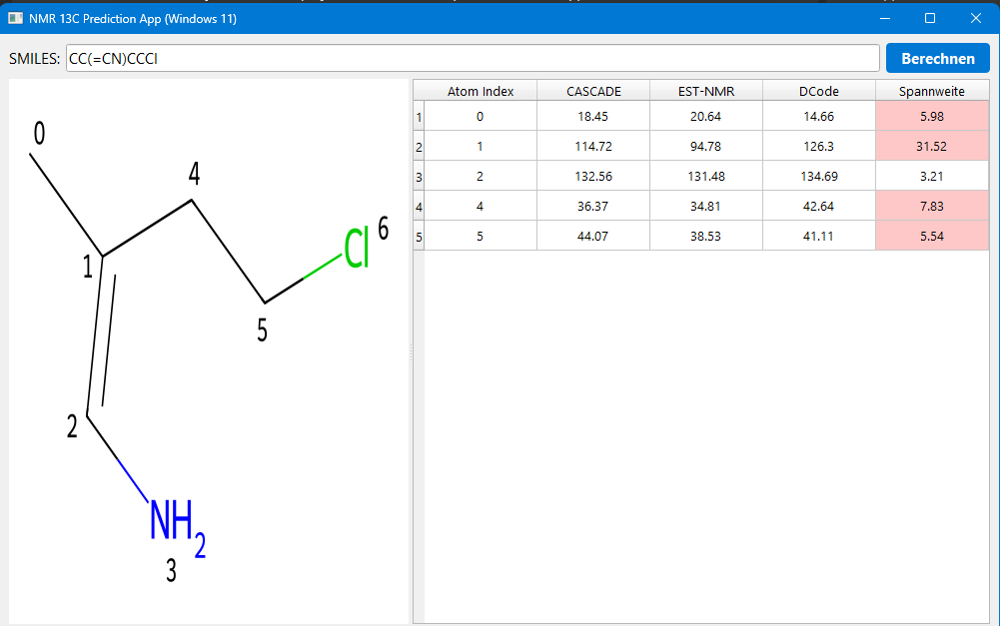
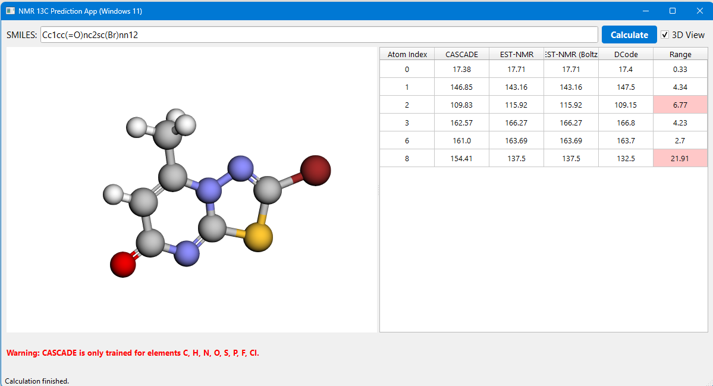

# A NMR Shift calculation program for Windows

## Features

* **Interactive Molecule Viewer**: Inspect the generated molecules seamlessly. The standard 2D view supports panning (drag & drop) and zooming (mouse wheel).
* **Cross-Highlighting**: Click a row in the results table to dynamically highlight the exact carbon atom in both the 2D SVG and the 3D viewer.
* **True 3D Conformer Visualization**: Toggle to a fully rotatable, interactive 3D view utilizing `3Dmol.js`. *(Installation of `PyQtWebEngine` via pip required)*
* **Conformer Details Tab**: Delve into the Boltzmann statistics directly within the app. A specialized "Conformers" tab lists generated conformers sorted by absolute energy over the MMFF94 force field, displaying relative energy differences alongside their calculated Boltzmann distribution weights. Allows interactive 3D screening of individual conformers!
* **Simulated Analytical Spectrum**: A dedicated "Spectrum" tab dynamically generates a visual 1D 13C-NMR spectrum using matplotlib. It plots peak intensities as Lorentzian functions and allows you to interactively click on peaks to highlight the assigned atoms in both the 2D/3D structure and the results table.
* **Auto-Assignment & Experimental MAE**: Paste your measured laboratory spectrum values (comma-separated). The application automatically correlates these experimental peaks to the individual carbon atoms using a **Greedy Consensus-Ranking Algorithm**. It takes the mathematical average of all active ML predictions to establish a relative ranking order of the carbons, and pairs them sequentially with your sorted experimental inputs. It immediately displays the matched values inside the table and outputs the Mean Absolute Error (MAE) for streamlined performance evaluation.
* **Multithreading & Acceleration**: High-performance backend routing shifts inference for PyTorch and TensorFlow off the main UI thread via `QThread`, preventing GUI freezes during demanding Boltzmann generations.
* **Offline Ketcher Integration**: Features an embedded, 100% offline-capable modern chemical drawing canvas via [Ketcher](https://lifescience.opensource.epam.com/ketcher/index.html) by EPAM Systems. You can sketch molecules intuitively and inject the created SMILES directly into the predictor model.
* **Caching & Session History**: Integrated dropdown to instantly replay prior molecules. Computed configurations, conformations, and AI data dynamically persist in RAM, yielding 0-millisecond loading times for repeat lookups.
* **Export Reports**: Calculate your molecule and instantly export the data! Choose between raw CSV data export or a fully formatted HTML Document Report, including the embedded 2D structural diagram and annotated results table.
* **English User Interface**: Fully localized, clean GUI with real-time status bar updates.
* **Smart Validation**: Dynamic warnings appear if unsupported elements are processed in the CASCADE model.
* **Consensus Scoring**: The app and notebooks natively calculate both single-conformer and 10-conformer Boltzmann-weighted predictions for the EST-NMR (and DCode) models, allowing for a robust predictive consensus.

## Installation and Usage

see [INSTALL_DE_EN.md](INSTALL_DE_EN.md)

You can also use the release Version. This is a portable python version including all you need. You can download and unzip this version. Then use Starte_NMR_App.bat.
This is for windows Users only.

## Sources

CASCADE

Guan, Y.; Sowndarya, S. V. S.; Gallegos, L. C.; St. John P. C.; Paton, R. S. Chem. Sci. 2021, DOI: 10.1039/D1SC03343C

est- NMR

Thomas Hehre, Philip E. Klunzinger, Bernard J. Deppmeier, William Sean Ohlinger, and Warren J Hehre
J. Org. Chem. 2025, 90, 11478−11485 
Practical Machine Learning Strategies 4: Using Neural Networks to Replicate Proton and 13C NMR Chemical Shifts Obtained from ωB97X-D/6-31G* Density Functional Calculations

## Acknowledgements

* **Ketcher**: The integrated chemical structure editor is [Ketcher](https://github.com/epam/ketcher), an open-source web-based chemical structure editor developed by EPAM Systems.
* **3Dmol.js**: 3D viewer provided by 3Dmol.js.

## License

This project is licensed under the [Apache License 2.0](LICENSE). 
You may freely use, modify, and distribute the work under the terms specified in the license.

Ketcher is licensed under the Apache 2.0 License by EPAM Systems.
