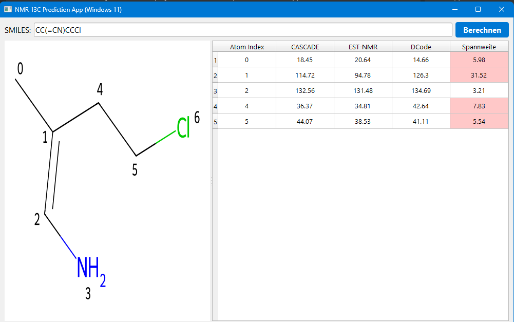
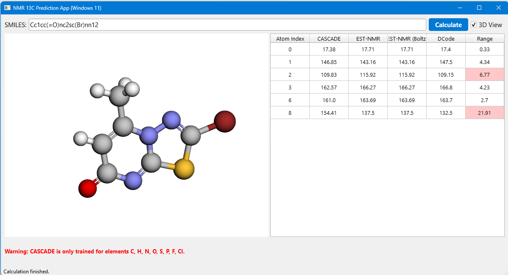

# 🧪 NMR 13C Prediction App

> A Windows desktop application for rapid, multi-model ¹³C NMR chemical shift prediction from SMILES strings.


---



---

## Overview

The **NMR 13C Prediction App** combines three independent ¹³C shift prediction engines into a single, interactive GUI. It allows chemists to:

- Instantly predict chemical shifts for any SMILES-encoded molecule
- Compare predictions from three fundamentally different algorithms
- Identify disagreements between models using the **Range (Spannweite)** metric
- Validate predictions against experimental spectra (Auto-MAE)
- Visualize the molecule in interactive 2D and 3D

All computation runs **locally and offline** — no internet connection or cloud API required.

---

## Prediction Methods

| Method | Type | Conformers | Boltzmann-Weighted |
|:---|:---|:---:|:---:|
| **CASCADE** | Graph Neural Network (TensorFlow/Keras) | ✅ Internal | ✅ |
| **EST-NMR** | 3D PyTorch Neural Network | ✅ 10 × MMFF94 | ✅ (Boltz variant) |
| **DCode** | Topology-Code Database Lookup | ✅ 10 × MMFF94 | ✅ |

All three methods generate up to 10 conformers via RDKit/MMFF94, weight their contributions using a Boltzmann distribution ($e^{-\Delta E / RT}$), and report the ensemble-averaged chemical shift per carbon atom.

A **Range** column (Max − Min across all models) flags atoms where the models disagree by more than 5 ppm with a ⚠️ warning — a reliable indicator of challenging stereocenters, unusual electronics, or conformational complexity.

---

## Key Features

- **Multi-Model Consensus** — Three orthogonal methods with Boltzmann weighting for robust shift estimation
- **Range / Spannweite Metric** — Per-atom disagreement score with color-coded alerts (> 5 ppm = ⚠️)
- **Auto-Assignment & MAE** — Paste your experimental ¹³C spectrum; the app automatically matches peaks to predicted atoms using a symmetry-aware consensus-ranking algorithm and reports the MAE for each model
- **Symmetry Averaging** *(Experimental)* — Hybrid 2D-topological + 3D-spatial ranking (0.4 Å tolerance) correctly groups chemically equivalent atoms (e.g., rotating methyls, symmetric phenyl rings) while distinguishing rigid geometric isomers (cis/trans)
- **Interactive 2D Structure View** — Pan, zoom, and cross-highlight atoms by clicking table rows or spectrum peaks
- **True 3D Conformer Viewer** — Fully rotatable 3D model via `3Dmol.js`; select individual conformers from the Boltzmann ensemble
- **Simulated ¹³C Spectrum** — Lorentzian peak simulation with interactive peak picking
- **Offline Ketcher Drawing Tool** — Sketch structures directly in the app (no internet needed)
- **Session Caching & History** — Instant replay of previously calculated molecules from RAM
- **Export Reports** — Export results as CSV or fully formatted standalone HTML report (includes 2D structure, Boltzmann table, MAE)
- **Dark Mode** — Full dark/light mode toggle
- **Molecule Info Tab** — Molecular formula, exact mass, LogP, TPSA, ring counts, rotatable bonds

---

## Screenshots




---

## Installation

### Option A — Portable Release (Recommended for Windows Users)

1. Download and unzip the portable release package (`NMR_App_Portable.zip`)
2. Double-click **`Start_NMR_App.bat`**

The portable version bundles a complete Python environment — no separate Python installation required.

---

### Option B — From Source

**Prerequisites:**
- Python 3.8 – 3.11 (added to `PATH`)
- Windows OS (optimized for Windows 11)

**Step 1 — Clone the repository:**
```bash
git clone https://github.com/your-repo/nmr-prediction-app.git
cd nmr-prediction-app
```

**Step 2 — Create & activate a virtual environment:**
```bash
python -m venv venv
venv\Scripts\activate
```

**Step 3 — Install dependencies:**
```bash
pip install pandas numpy torch PyQt5 rdkit tf-keras nfp scipy scikit-learn
```

> **Optional:** Install `PyQtWebEngine` to enable the interactive 3D viewer and the Ketcher drawing tool:
> ```bash
> pip install PyQtWebEngine
> ```

**Step 4 — Place model files:**

Ensure the following directory structure is present:
```
project/
├── models/
│   ├── cascade/
│   │   ├── trained_model/best_model.hdf5
│   │   └── preprocessor.p
│   └── DLNMR1.pt
├── codes/
│   └── v3_update_23_10_2025.csv
└── nmr_app.py
```

**Step 5 — Launch:**
```bash
python nmr_app.py
```
Or double-click **`Start_NMR_App.bat`**.

---

## Usage

1. **Enter a SMILES** string in the input field, or click **🖌 Draw** to open the Ketcher structure editor
2. Click **Calculate** — models load on first run (one-time delay of ~20–60 s)
3. Inspect the results table (Atom Index, Sym. Rank, CASCADE, EST-NMR, EST-NMR Boltz, DCode, Range)
4. *(Optional)* Paste your experimental ¹³C shifts into **Exp. Data** (comma-separated, e.g. `128.4, 115.0, 55.3`) — the app auto-assigns peaks and displays the MAE for each model
5. *(Optional)* Enable **Symmetry Average** to average shifts across chemically equivalent atoms
6. Switch tabs to explore the **Conformer ensemble**, **Molecule Info**, or **Spectrum** view
7. Click **Export Report** to save a CSV or HTML document

---

## Documentation

A detailed technical documentation covering all algorithms, the assignment procedure, error handling, and design decisions is available in:

📄 [`Documentation.md`](Documentation.md)

Topics covered:
- Program flow (Mermaid flowchart)
- CASCADE, EST-NMR, DCode algorithm details
- Symmetry averaging methodology
- Experimental data assignment (Auto-MAE) — including the two-stage matching algorithm, the role of the cross-model average (`avg`), and known limitations under high model disagreement

---

## Sources & Citations

**CASCADE (Graph Neural Network)**
> Guan, Y.; Sowndarya, S. V. S.; Gallegos, L. C.; St. John, P. C.; Paton, R. S.  
> *Chem. Sci.* **2021**, DOI: [10.1039/D1SC03343C](https://doi.org/10.1039/D1SC03343C)

**EST-NMR (PyTorch Neural Network)**
> Hehre, T.; Klunzinger, P. E.; Deppmeier, B. J.; Ohlinger, W. S.; Hehre, W. J.  
> *J. Org. Chem.* **2025**, *90*, 11478–11485.  
> DOI: [10.1021/acs.joc.5c00927](https://doi.org/10.1021/acs.joc.5c00927)

**DCode (Topology-Code Algorithm)**
> Repository: [steto123/dcode](https://github.com/steto123/dcode)  
> Database: `v3_update_23_10_2025.csv` (> 47 MB, embedded topology-code lookup)

**Ordinal Matching Reference**
> Bally, T.; Rablen, P. R.  
> *J. Org. Chem.* **2011**, *76*, 4818–4830.  
> (Basis for the shift-sorted assignment strategy used in Auto-MAE)

---

## Acknowledgements

- **[Ketcher](https://github.com/epam/ketcher)** — Offline chemical structure editor by EPAM Systems (Apache 2.0)
- **[3Dmol.js](https://3dmol.csb.pitt.edu/)** — Interactive 3D molecular viewer
- **[RDKit](https://www.rdkit.org/)** — Cheminformatics library for SMILES parsing, 2D/3D embedding, and MMFF94 force field
- **[PyQt5](https://riverbankcomputing.com/software/pyqt/)** — GUI framework

---

## License

This project is licensed under the **[Apache License 2.0](LICENSE)**.  
You may freely use, modify, and distribute the work under the terms specified in the license.

Ketcher is licensed under the Apache 2.0 License by EPAM Systems.
